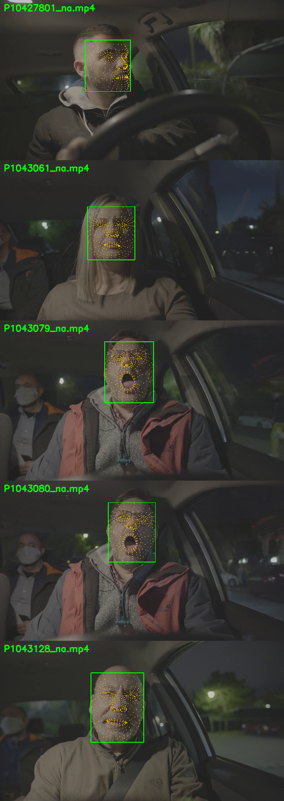

# CS-477 Week 5 - SG-1 Face and Landmark Detection

**Students:** Muhammad Bilal Maqbool (470990) , Muhammad Sharjeel Hanif (455543) 
**Project stream:** B - Driver Drowsiness Monitoring
**Sub-group:** SG-1 - Driver Face and Landmark Detection

This folder is a runnable Week 5 experiment package. It compares MediaPipe Face Landmarker configurations on the *same video frames*, writes detection/landmark outputs, records latency and coverage, and can calculate precision/recall against manually annotated face boxes. It does not invent results for footage that has not been supplied or labeled.

For a complete explanation with system diagrams, frame-processing flow, normalization, interface, metric definitions, results, and limitations, start with [`docs/SG1_DEEP_DIVE.md`](docs/SG1_DEEP_DIVE.md). The hands-on presentation/demo script is [`docs/SG1_DEMO_AND_EXPLANATION.md`](docs/SG1_DEMO_AND_EXPLANATION.md), and the course-rubric audit is [`docs/SG1_EVALUATION_CHECKLIST.md`](docs/SG1_EVALUATION_CHECKLIST.md).

## Headline results

| Configuration | Coverage | Mean inference | End-to-end desktop FPS | 20-frame box F1 |
|---|---:|---:|---:|---:|
| Baseline, 256 px / 0.50 | 99.966% | 8.249 ms | 77.081 | 0.85 |
| Lower thresholds, 256 px / 0.35 | 99.966% | 8.132 ms | 78.362 | 0.85 |
| Lower resolution, 192 px / 0.50 | 99.966% | 6.274 ms | 92.193 | 0.85 |

These results cover five mostly nighttime clips (2,932 frames) and only 20 manually labeled boxes. The 192 px setting is a provisional speed candidate, not a final accuracy or Jetson decision. See the experiment record for the one all-black missed frame and interpretation. Do not commit source videos, annotated face videos, or model binaries; this repository keeps aggregate evidence and small manual-label CSVs while the full streams are regenerated locally.

## Visual input/output example

Each panel below shows an input frame from a sample driver-facing clip with the **MediaPipe output overlaid**: the green rectangle is the landmark-derived face ROI and the yellow dots are the predicted facial landmarks. This is a qualitative demonstration of what SG-1 emits, not the manual ground-truth label. The frame is both the input image and the annotated output view; the full original video is not included.



See [`docs/INPUT_OUTPUT_EXAMPLE.md`](docs/INPUT_OUTPUT_EXAMPLE.md) for exactly what is being shown and how to reproduce it locally. The video frames contain visible people and this repository is public; do not add additional source footage or face overlays without confirming permission to publish them.

## SG-1 processing idea and algorithm choices

| Stage | What the code does | Method / tool |
|---|---|---|
| Read frame | Reads each sampled video frame and its timestamp. | OpenCV `VideoCapture` |
| Resize | Scales the frame to the selected long-side resolution while preserving aspect ratio. | OpenCV `resize`, area interpolation |
| Detect face and landmarks | Runs the same pretrained face detector and landmark model for all variants. | MediaPipe Face Landmarker; one primary driver face |
| Build face ROI | Uses min/max landmark coordinates to create a face bounding rectangle. | NumPy; box is landmark-derived |
| Preserve interface | Emits frame ID, timestamp, dimensions, box, normalized landmark points and status. | JSON Lines; stable SG-1 output schema |
| Compare settings | Runs baseline, threshold and input-resolution variants over the same video. | Controlled parameter study |
| Measure speed and coverage | Calculates face coverage, latency percentiles, approximate inference FPS and end-to-end throughput. | Python timing + CSV summary |
| Score accuracy | Matches predicted face rectangles with manually labeled ground-truth boxes using IoU >= 0.50. | Precision, recall, F1, false positives and missed faces |

**Week 5 alternatives:** baseline 256 px / 0.50 thresholds; lower acceptance thresholds 0.35 at 256 px; and lower input resolution 192 px / 0.50 thresholds. This provides one baseline plus two meaningful alternatives while keeping the model, clip and frame sampling fixed. A later study can add a different detector, but its outputs should be compared using the same labeled frames and interface.

## What the Week 5 experiment compares

`configs/experiment.json` defines three configurations using the same MediaPipe model:

1. Baseline: 256 px input, 0.50 face/presence/tracking thresholds.
2. Lower threshold: 256 px input, 0.35 thresholds. This tests whether a lower acceptance threshold improves coverage at the cost of false detections.
3. Lower resolution: 192 px input, 0.50 thresholds. This tests the speed/reliability trade-off.

These are controlled configuration comparisons, not three separate trained models. All configurations process the same source clip. Change/add a configuration in the JSON file for a different threshold or resolution study.

## Setup (Windows PowerShell)

Open PowerShell in this folder and run:

```powershell
py -3.11 -m venv .venv
.\.venv\Scripts\Activate.ps1
python -m pip install --upgrade pip
pip install -r requirements.txt
python scripts\download_model.py
```

If PowerShell blocks virtual-environment activation, run the environment's Python directly instead:

```powershell
.\.venv\Scripts\python.exe -m pip install -r requirements.txt
.\.venv\Scripts\python.exe scripts\download_model.py
```

Python 3.10-3.12 is recommended. On Jetson, install the Python/OpenCV/MediaPipe builds compatible with the team's JetPack image; desktop wheels are not necessarily compatible with Jetson ARM64.

## Capture a test clip from your camera

If you do not already have an approved driver-facing clip, record a short clip (for example, 30 seconds) with your webcam or the group's camera:

```powershell
python scripts\capture_video.py --camera 0 --duration 30 --output data\videos\driver_sample.mp4
```

Keep the same recorded clip for every configuration. Include consented examples with the face near/far, looking slightly left/right, glasses if available, and partial occlusion. Do not put personal footage in a public repository.

The complete local run is then:

```powershell
python scripts\run_experiment.py --input data\videos\driver_sample.mp4 --save-video
```

## Run the experiment

Place an approved driver-facing video in `data/videos/` (this directory is ignored by Git), then run:

```powershell
python scripts\run_experiment.py --input data\videos\your_clip.mp4
```

To also create annotated videos:

```powershell
python scripts\run_experiment.py --input data\videos\your_clip.mp4 --save-video
```

Results go to `results/<clip-name>/`:

- `comparison.csv`: one row per configuration, with frames, face coverage, mean/p95 inference latency, approximate processed FPS, and landmark jitter proxy.
- `predictions_<config>.jsonl`: per-frame SG-1 outputs (face box, normalized landmarks, timestamps and status).
- `failures_<config>.csv`: frames where no face was returned, for targeted failure review.
- `annotated_<config>.mp4`: optional visualization.
- `run_metadata.json`: source, frame size/rate, configuration and model details.

`face_coverage` is the share of processed frames in which the model returned a face. It is a useful reliability indicator, but **it is not precision or recall**. The jitter figure measures normalized face-center changes across adjacent detected frames; actual driver movement contributes to it, so interpret it as a stability proxy rather than landmark accuracy. Generated per-frame landmark JSONL and videos are excluded from Git; aggregate comparison/box metrics can be committed after checking that they contain no private paths or personal data.

## Precision / recall with labeled face boxes

For detection accuracy, annotate frames from the same video. Create a CSV with one row per sampled frame:

```csv
frame_idx,x1,y1,x2,y2
0,410,88,832,612
30,415,91,830,610
60,420,94,828,606
```

Coordinates are pixel values in the original video frame. Use an empty box row such as `30,,,,` when no face should be visible. The evaluator uses one primary driver face per frame and IoU matching (default 0.5). Annotate a representative mix of near/far, head pose, glasses, occlusion, and lighting. A spreadsheet or CVAT/Label Studio export can be converted to this format.

Run:

```powershell
python scripts\evaluate_boxes.py --predictions results\your_clip\predictions_baseline.jsonl --labels data\labels\your_clip_boxes.csv
```

Repeat for each predictions file and compare precision, recall, F1, false positives and missed faces. Do not compare accuracy from differently sampled frames.

## SG-1 output interface

Each JSONL line contains a result for one frame:

```json
{
  "frame_id": 0,
  "timestamp_ms": 0,
  "image_width": 1280,
  "image_height": 720,
  "status": "OK",
  "face_bbox_xyxy": [410, 88, 832, 612],
  "landmarks_xy_normalized": [[0.42, 0.25], [0.43, 0.24]],
  "landmark_count": 478,
  "detection_confidence": null,
  "config_name": "baseline"
}
```

MediaPipe's Face Landmarker task returns landmarks, but its high-level result does not expose a per-face detection confidence. The configured confidence values are minimum acceptance thresholds, not observed scores. Therefore `detection_confidence` is `null`; downstream SG-2/SG-3 must not interpret the threshold as a measured confidence. Missing-face outputs use `status: NO_FACE`, a null box, and an empty landmark list. The interface retains frame IDs/timestamps for downstream synchronization.

## Week 5 decision record

The comparison on five downloaded driver-facing clips, including exploratory manual face-box evaluation on 20 sampled frames, is recorded in `docs/WEEK5_EXPERIMENT_RECORD.md`. The annotation rules and label files are in `docs/MANUAL_ANNOTATION_PROTOCOL.md` and `results/downloaded_samples/ground_truth/`; pooled box metrics are in `results/downloaded_samples/manual_box_metrics_summary.csv`. The 192 px recommendation is provisional: it performed similarly on this small label set and was faster on this desktop, but broader accuracy and Jetson performance remain unverified. If the group selects different common clips, rerun all configurations on those same clips before finalizing. Keep results and the chosen configuration with the subgroup branch; avoid committing raw or personally identifying video unless the team has permission.

The recorded 100-frame demo and presentation explanation are in `docs/SG1_DEMO_AND_EXPLANATION.md`; generated overlay videos and a comparison table are under `results/demo/` in the full local working package (video outputs are intentionally excluded from the GitHub-ready export). The official SG-1 criterion/rubric status is in `docs/SG1_EVALUATION_CHECKLIST.md`.

To repeat the comparison on the same local downloads in PowerShell:

```powershell
Get-ChildItem "$env:USERPROFILE\Downloads\P104*_na.mp4" | ForEach-Object {
    python scripts\run_experiment.py `
      --input $_.FullName `
      --output-dir "results\downloaded_samples\$($_.BaseName)"
}
```

## Current limitations

- Only one primary face is configured (`num_faces=1`), as expected for a driver camera.
- Landmarks are returned in normalized coordinates; the face box is the enclosing rectangle of those landmarks, not an independent detector box.
- Current precision/recall/F1 are based on only 20 manually labeled frames and should be expanded before making a broad accuracy claim.
- Desktop results do not establish Jetson speed. Repeat the same experiment on Jetson and record its power mode, JetPack version and `tegrastats` observations before claiming embedded performance.
- The model is a general face landmark model, not a safety-certified driver-monitoring component.

## Source and license

The implementation uses Google's MediaPipe Face Landmarker task and its published model bundle. Review MediaPipe's current model card and license before redistribution or public demonstrations. The official Python guide is linked from the course report/README references.

Official references: [MediaPipe Face Landmarker Python guide](https://developers.google.com/edge/mediapipe/solutions/vision/face_landmarker/python), [MediaPipe Face Landmarker model overview](https://developers.google.com/edge/mediapipe/solutions/vision/face_landmarker), [NVIDIA Jetson Orin Nano JetPack setup](https://docs.nvidia.com/jetson/orin-nano-devkit/user-guide/latest/setup_jetpack.html), and [NVIDIA tegrastats guide](https://docs.nvidia.com/jetson/archives/r36.4.3/DeveloperGuide/AT/JetsonLinuxDevelopmentTools.html).
