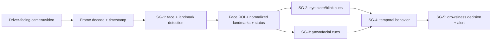
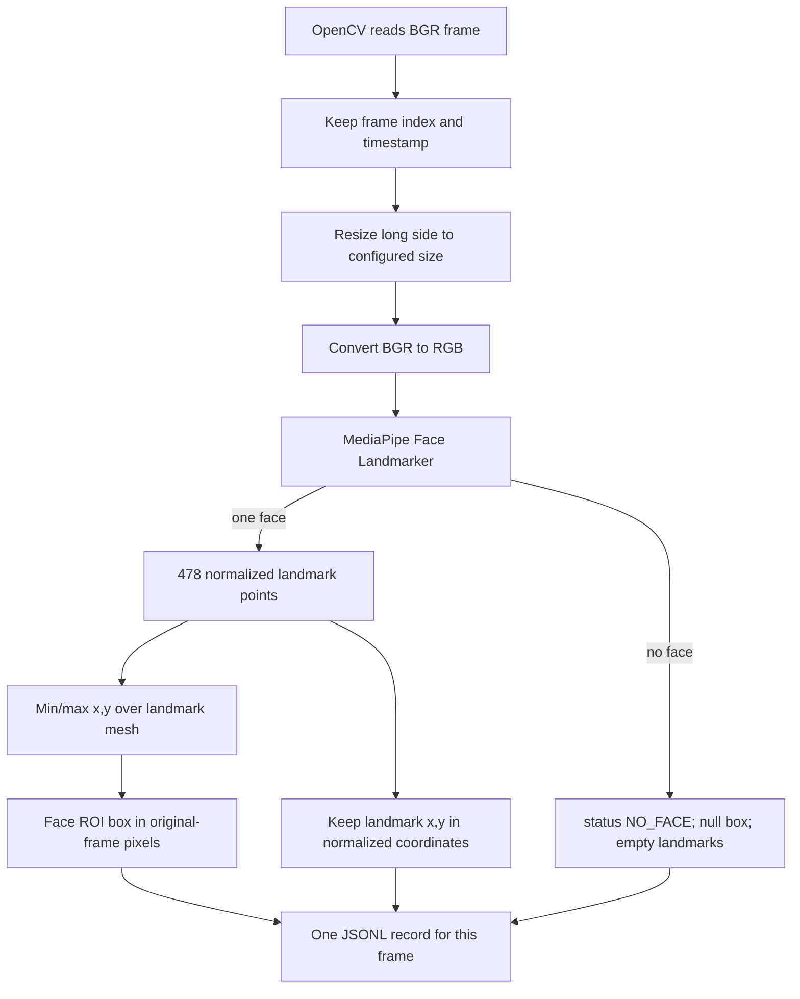

# SG-1 Deep Dive: Driver Face and Landmark Detection

**Student:** Muhammad Bilal Maqbool (470990)
**Course task:** CS-477 Week 5, Stream B, SG-1
**Scope:** Detect one driver's face, estimate facial landmarks, and pass a stable per-frame ROI/landmark record to downstream cue modules. This module does **not** infer drowsiness or issue an alert.

## 1. Where SG-1 sits in the whole system



SG-1's job is to convert each image into a geometric observation. Eye closure or mouth opening is not itself a final drowsiness decision. SG-2/SG-3 produce frame-level cues, SG-4 analyzes persistence over time, and SG-5 applies the system's decision/alert logic.

## 2. How one frame is processed



### Step by step

1. **Decode and synchronize.** OpenCV reads a frame, its pixel dimensions, and video FPS. The frame index and derived timestamp are retained so downstream modules can associate cues from the same instant.
2. **Resize for the experiment.** The longest image side is reduced to 256 px for baseline/threshold runs or 192 px for the lower-resolution alternative. Aspect ratio is preserved. Smaller input means less image computation, generally improving speed while risking loss of fine detail.
3. **Convert color format.** OpenCV supplies BGR pixels; MediaPipe expects RGB. The code converts the channel order before creating the model image.
4. **Estimate face landmarks.** The pretrained MediaPipe Face Landmarker returns a mesh for up to one face (`num_faces=1`, appropriate to a driver-camera view). In these runs each detected face returned 478 points. VIDEO mode lets the task use temporal tracking between successive frames; timestamps are forced to increase monotonically as required by that mode.
5. **Create a face ROI.** The rectangle is the minimum/maximum landmark x/y extent, mapped back to original-frame pixel coordinates. It is a landmark-derived face rectangle, not a separate detector's independently predicted box.
6. **Serialize a stable record.** A JSON Lines row is emitted for every processed frame. A missing face still produces a row with `NO_FACE`, a null rectangle, and an empty landmark array, rather than silently dropping the frame.

## 3. What coordinate normalization means

Each landmark's x and y are represented as fractions of image width and height, typically from 0 to 1. For example, `(0.5, 0.25)` means halfway across the image and one-quarter down. This is useful because a downstream eye/mouth module can use positions consistently even if the video is resized.

The detector returns coordinates normalized to the resized image. Because resizing preserves the same aspect ratio, those normalized fractions also locate the corresponding point in the original frame. To create the ROI in pixels, the code multiplies the normalized positions by the resized dimensions, maps them to original dimensions, takes min/max, and clamps coordinates to the frame bounds.

Normalization does **not** make a landmark more accurate, remove pose/lighting effects, or mean the model was trained on normalized source data; it is a coordinate representation. This package does not normalize image brightness or perform face alignment.

## 4. Per-frame interface

The JSONL interface carries:

| Field | Meaning |
|---|---|
| `frame_id`, `timestamp_ms` | Frame identity/time for synchronization |
| `image_width`, `image_height` | Original frame geometry |
| `status` | `OK` or `NO_FACE` |
| `face_bbox_xyxy` | `[x1,y1,x2,y2]` pixel rectangle, or null |
| `landmarks_xy_normalized` | Array of `[x,y]` fractions; empty when no face |
| `landmark_count` | Number of returned landmarks (478 in these runs) |
| `config_name` | Experiment setting that produced this row |
| `detection_confidence` | Null: the used high-level MediaPipe result does not expose per-face confidence |

Configured confidence thresholds are acceptance thresholds, **not** measured confidence scores. Therefore the code does not place a threshold into `detection_confidence`. The downstream groups must agree that this schema is the frozen V1 interface and test it; the course report requires preserving that interface, but this package cannot claim SG-2/SG-3 have approved it without their confirmation.

## 5. Experiment design

All settings use the same model, five input clips, full-frame processing, and the same 20 manual annotation frames:

| Setting | Input long side | Face/presence/tracking thresholds | Question |
|---|---:|---:|---|
| Baseline | 256 px | 0.50 / 0.50 / 0.50 | Reference configuration in this package |
| Lower threshold | 256 px | 0.35 / 0.35 / 0.35 | Does accepting weaker detections improve coverage? |
| Lower resolution | 192 px | 0.50 / 0.50 / 0.50 | Can lower input size improve throughput without reducing observed results? |

This is a controlled parameter comparison, not three models trained separately. It is only a verified Week 4 baseline if the team confirms that this MediaPipe 256 px setting matches the Week 4 implementation. The actual Week 4 baseline code was not available during this experiment.

## 6. Results and interpretation

The five 1920x1080, 25 FPS clips total 2,932 frames (about 117.3 seconds). They are mostly nighttime driver-facing footage, so they are realistic but not broad coverage of operating conditions.

| Setting | Face + landmark frames | Coverage | Mean inference | p95 inference | End-to-end desktop throughput |
|---|---:|---:|---:|---:|---:|
| Baseline 256 / 0.50 | 2,931 / 2,932 | 99.966% | 8.249 ms | 8.861 ms | 77.081 FPS |
| Lower threshold 256 / 0.35 | 2,931 / 2,932 | 99.966% | 8.132 ms | 8.682 ms | 78.362 FPS |
| Lower resolution 192 / 0.50 | 2,931 / 2,932 | 99.966% | 6.274 ms | 6.746 ms | 92.193 FPS |

The sole no-face result was frame 576 of `P1043079_na`, which is fully black. All three settings miss the same unusable input frame. Landmark availability matches detected-face coverage in this sample, but there is no manually annotated landmark ground truth; this tests availability, not coordinate accuracy.

### Manual face-box check

Four frames per clip (20 total) were manually box-labeled and scored with intersection over union (IoU). IoU is `intersection area / union area`: 1 is identical rectangles and 0 is no overlap. At the chosen 0.50 threshold, a prediction/reference pair with lower overlap is a localization mismatch.

| Setting | TP | IoU-mismatch FP | IoU-mismatch FN | Precision | Recall | F1 |
|---|---:|---:|---:|---:|---:|---:|
| Baseline | 17 | 3 | 3 | 0.85 | 0.85 | 0.85 |
| Lower threshold | 17 | 3 | 3 | 0.85 | 0.85 | 0.85 |
| Lower resolution | 17 | 3 | 3 | 0.85 | 0.85 | 0.85 |

Each of the three below-threshold cases has a prediction and a manual face box; the evaluator counts each such mismatch as one FP and one FN. These are paired localization errors, not three invented faces plus three unrelated missing faces. Since only 20 frames were labeled, a single frame changes recall by about five percentage points. Do not treat 0.85 as a stable population estimate.

### Week 6 decision

Carry 192 px / 0.50 forward as a **provisional speed candidate**: it was about 19.6% faster end-to-end than baseline on this desktop (`(92.193 / 77.081 - 1) × 100`) with the same observed coverage and small-set box scores. Lowering thresholds showed no measured coverage or labeled-box benefit. Re-test on diverse conditions and the target Jetson before selecting a final setting. Desktop throughput is not Jetson throughput.

## 7. What is and is not established

**Established by this run:** three configs ran on identical five-clip footage; detector/landmark availability and timing were recorded; one black-frame failure was reviewed; 20 face boxes were manually checked; code writes frame-synchronized ROI/landmark records; a 100-frame demonstration ran.

**Not established:** broad detector accuracy, landmark coordinate accuracy, robustness to systematic profile/occlusion/glasses/daylight tests, equivalence to the actual Week 4 baseline, acceptance of the V1 interface by SG-2/SG-3, or performance/memory on Jetson. These should be explicit Week 6 tasks, not assumed from high coverage.

## 8. Reproduce and inspect outputs

```powershell
pip install -r requirements.txt
python scripts\download_model.py
python scripts\run_experiment.py --input "C:\path\to\approved_driver_video.mp4" --save-video
```

For manual-box metrics:

```powershell
python scripts\evaluate_boxes.py `
  --predictions results\your_clip\predictions_baseline.jsonl `
  --labels data\labels\your_clip_boxes.csv
```

The full experiment record is `WEEK5_EXPERIMENT_RECORD.md`; the rubric checklist is `SG1_EVALUATION_CHECKLIST.md`; and the five label CSVs and aggregate evidence are under `results/downloaded_samples/`. Raw video, annotated video, model binary, and per-frame landmark streams are excluded from the GitHub-ready submission by design; run locally to regenerate them.
